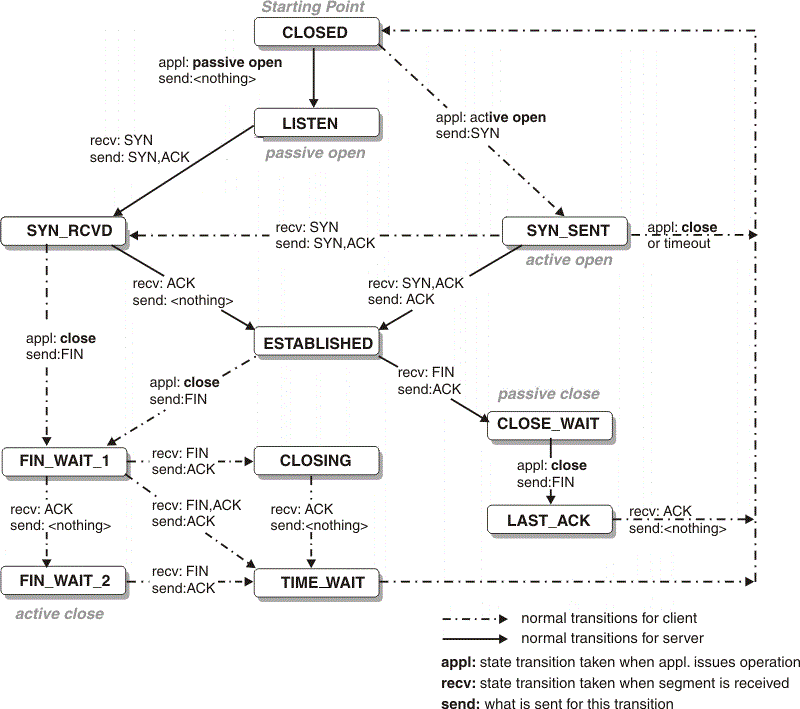

# All about TCP Connection Establishment and Termination

3-way TCP handshake in establishment -

1. The server must be prepared to accept an incoming connection. This is normally done by calling `socket`, `bind`, and `listen` and is called a _passive open_.

2. The client issues an _active open_ by `connect`. This causes the client TCP to send a `synchronize(SYN)` segment, which tells the server the client's initial sequence number for the data that the client will send on the connection. There is no data sent with the SYN, just few headers.

3. The server must `acknowledge(ACK)` the client's SYN and the server must also send its own SYN containing the initial sequence number for the data that the server will send on the connection. The server sends its SYN and the ACK of the client's SYN in a single segment.

4. The client `acknowledge(ACK)` the server's SYN.


4-way handshake in termination - 

1. One application (Initiator) calls close first, and we say that this end performs the _active close_. This end's TCP sends a `FIN segment`, which means it is finished sending data.
2. The other end performs `passive close`. The received FIN is acknowledged by TCP via `ACK segment`. The receipt of the FIN is also passed to the application as an _EOF_ (after any data that may have already been queued for the application to receive), since the receipt of the FIN means the application will not receive any additional data on the connection.
3. The other end, the application will `close` it's socket. This causes its TCP to send a `FIN segment`.
4. Initiator acknowledge the final FIN by sending `ACK segment`.


* Both establishment and termination have similer workflow but in termination other end can not send FIN along with ACK beacuse you may have data yet to send. That's the reason, it waits till it send all the data and then sends the FIN.

* Between Steps 2 and 3 it is possible for data to flow from the end doing the `passive close` to the end doing the `active close`. This is called a `half-close` (Only one end can close the connection).

* The sending of each FIN occurs when a socket is closed. Application calls close for this to happen, but realize that when a Unix process terminates, all `open descriptors are closed`, which will also cause a FIN to be sent on any TCP connection that is still open.

*  Both client and server (less common) can initiate termination, wheras only client initiate the establishment.





## TIME_WAIT State

The end that performs the active close goes through this state (2nd FIN received, ACK sent, waiting for 2MSL). The duration that this endpoint remains in this state is twice the `maximum segment lifetime (MSL)`, sometimes called `2MSL`. It is `the maximum amount of time that any given IP datagram can live in a network.`

```
TIME_WAIT state allow old duplicate segments to expire in the network.
```

Let's assume a client had just closed a connection from port B. It is possible for kernel to create another connection by reusing same port B. This latter connection is called an `incarnation of the previous connection` since the IP addresses and ports are the same. TCP must prevent `lost duplicates` from previous connection from reappearing. To do this, TCP will not initiate a new incarnation of a connection that is currently in the TIME_WAIT state. `Since the duration of the TIME_WAIT state is 2xMSL, this allows MSL seconds for a sent packet to be lost, and another MSL seconds for the reply to be lost.` By enforcing this rule, we are guaranteed that when we successfully establish a TCP connection, all old duplicates from previous incarnations of the connection have expired in the network.


## Few terminologies

* **maximum segment size (MSS)** - maximum amount of TCP data that the peer can send per segment. MSS option is sent along with SYN.
* **maximum transmission unit (MTU)** is the largest size frame or packet -- in bytes or octets (eight-bit bytes) -- that can be transmitted across a data link. It is most used in reference to packet size on an Ethernet network using the Internet Protocol (IP).
